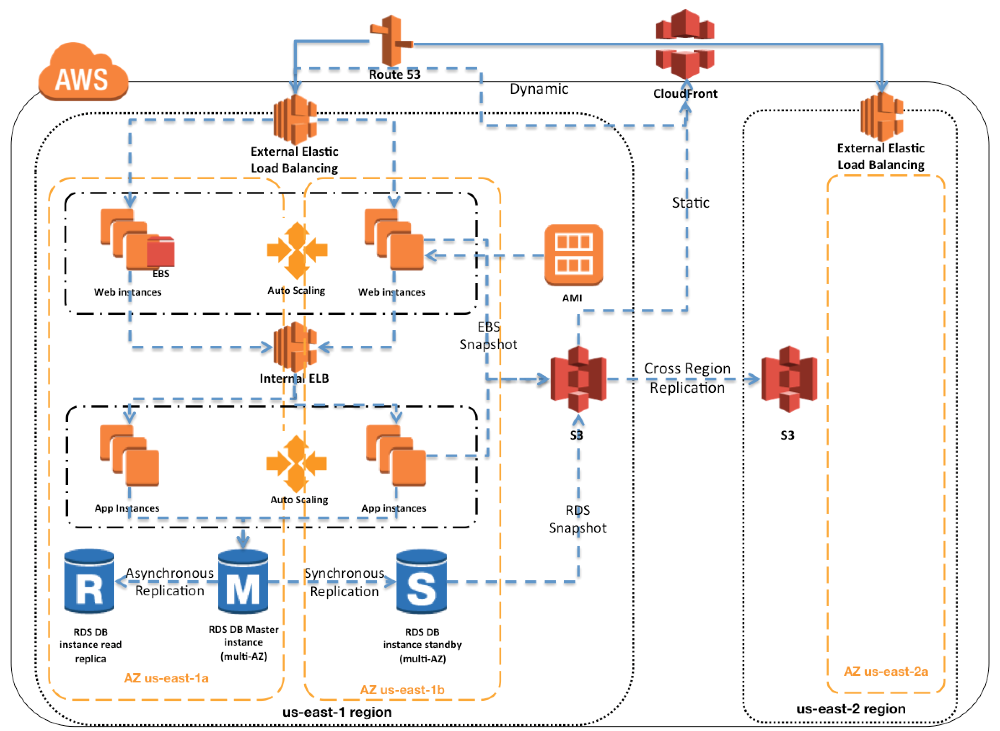

# The Terraform EC2 Project :sunglasses:

- Learning Terraform to create a scalable app infrastructure

## Give a Star! :star:

If you liked the project, please give a star ;)

## You need some of the fallowing tools :exclamation:

-  Terraform
-  AWS Account

## Description :books:

### AWS High Availability & Fault Tolerance Architecture 🏗️

- Amazon Web Services provides services and infrastructure to build reliable, fault-tolerant, and highly available systems in the cloud.

- Fault-tolerance defines the ability for a system to remain in operation even if some of the components used to build the system fail.

- Most of the higher-level services, such as S3, SimpleDB, SQS, and ELB, have been built with fault tolerance and high availability in mind.

- Services that provide basic infrastructure, such as EC2 and EBS, provide specific features, such as availability zones, elastic IP addresses, and snapshots, that a fault-tolerant and highly available system must take advantage of and use correctly.

### Regions & Availability Zones 🌐

- Amazon Web Services are available in geographic Regions and with multiple Availability zones (AZs) within a region, which provide easy access to redundant deployment locations.
AZs are distinct geographical locations that are engineered to be insulated from failures in other AZs.

- Regions and AZs help achieve greater fault tolerance by distributing the application geographically and help build multi-site solution.
AZs provide inexpensive, low latency network connectivity to other Availability Zones in the same Region

- By placing EC2 instances in multiple AZs, an application can be protected from failure at a single data center
It is important to run independent application stacks in more than one AZ, either in the same region or in another region, so that if one zone fails, the application in the other zone can continue to run.

### Amazon Machine Image – AMIs 🔐

- EC2 is a web service within Amazon Web Services that provides computing resources.

- Amazon Machine Image (AMI) provides a Template that can be used to define the service instances.

- Template basically contains a software configuration (i.e., OS, application server, and applications) and is applied to an instance type
AMI can either contain all the softwares, applications and the code bundled or can be configured to have a bootstrap script to install the same on startup.
A single AMI can be used to create server resources of different instance types and start creating new instances or replacing failed instances

